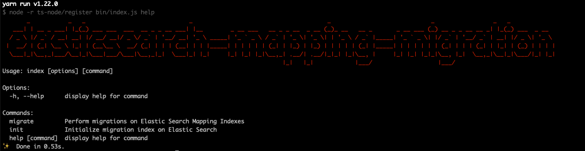
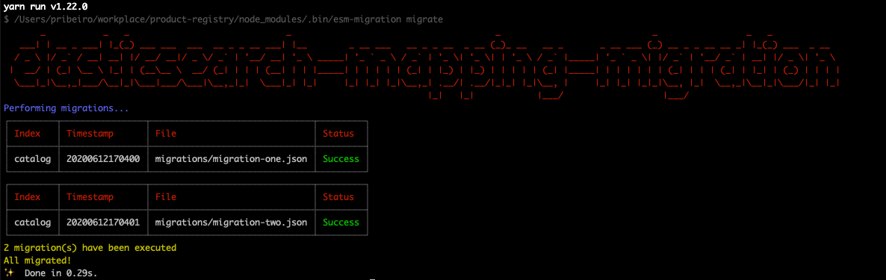

# Elastic Search Mapping Migration

Easy way of executing changes on an existing Elastic Search Mapping through code. 
This is very similar to Database Migration mechanisms such as DB Migration package. 

## Installation

````bash
yarn add elasticsearch-mapping-migration
````

Then run
````bash
yarn esm-migration help
````



Set the following environment variables
 
 ````bash
ESMIGRATION_HOST=your-elasticsearch-host
ESMIGRATION_PORT=your-elasticsearch-port
ESMIGRATION_PROTOCOL=your-elasticsearch-protocol-http-or-https
ESMIGRATION_MIGRATION_LIST_FILE=path/to/your/migration-list.json
ESMIGRATION_MIGRATION_INDEX=esm-migration
````

All paths must be relative to your project root directory. So no absolute path here. 
 
The variable `ESMIGRATION_MIGRATION_LIST_FILE` set where your list of migrations will be.

the variable `ESMIGRATION_MIGRATION_INDEX` set which elastic search index will be created to keep track of all migrations.

## Quick Start

### Initializing the migration index
````bash
yarn esm-migration init
````
This will create an index to store all performed migrations identified by timestamp


If the `init` is run again then you have


### Migration list file
Migration list example
````json
[
  {
    "timestamp": "20200612170400",
    "file": "src/migrations/migration-1.json"
  },
  {
    "timestamp": "20200612170401",
    "file": "src/migrations/migration-2.json"
  }
]
````
The migration list file contains a list of migrations to be executed. Each item has the property `timestamp` which is an unique identifier. 

Once it is performed, then that `timestamp` is stored. That is how a migration is only executed once.  

### Migration file

Migration file example
```json
{
  "index_target": "<YOUR-INDEX-NAME>",
  "type": "<YOUR-FIELD-NAME>",
  "migration" : {
    "properties": {
      "<YOUR-FIELD-NAME>": {
        "type": "text",
        "fielddata": true,
        "fields": {
          "raw": {
            "type": "keyword"
          },
          "normalized": {
            "type": "keyword",
            "normalizer": "name_keyword_normalizer"
          }
        }
      }
    }
  }
}
```

As Elastic Search does not allow multiple field mapping update, every migration file will only have 1 field update

`index_target` is the index your documents are and where the mapping update will be performed on
`type` is the field name
`migration` is the actual mapping update. See [Elastic Search Update Mapping Reference](https://www.elastic.co/guide/en/elasticsearch/reference/5.6/indices-put-mapping.html)

### Performing a migration
````bash
yarn esm-migration migrate
````
Then there should be an output like below


### Behind the scenes

When the command `esm-migration migrate` is executed, the migration list file is loaded. Then all migrations within will be performed.
